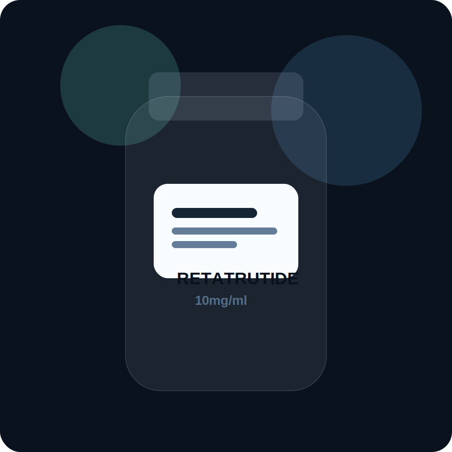

<!DOCTYPE html>
<html lang="en">
<head>
  <meta charset="UTF-8" />
  <meta name="viewport" content="width=device-width, initial-scale=1.0" />
  <title>PYROX BIO</title>
  <meta name="description" content="Supplying the Australian domestic market with quality experimental peptides for research and development." />
  <link rel="preconnect" href="https://fonts.googleapis.com">
  <link rel="preconnect" href="https://fonts.gstatic.com" crossorigin>
  <link href="https://fonts.googleapis.com/css2?family=Inter:wght@400;500;600;700;800&display=swap" rel="stylesheet">
  <link rel="stylesheet" href="styles.css" />
</head>
<body>
  

  <header class="site-header">
    
PYROX BIO

    <a class="header-cta" href="https://t.me/+Nrji83EQmVQxNGJl" target="_blank" rel="noopener noreferrer">Join Telegram</a>
  </header>

  <main>
    <section class="hero panel panel--hero">
      

        
      

      

        
Australian Domestic Market

        <h1>PYROX BIO</h1>
        

          Supplying the Australian domestic market with quality experimental peptides for research and development.
        

        

        

          If we can't help you,
          we know who can.
        

        
Scroll to unlock the next layer.

      

      <a class="scroll-indicator" href="#hot-sellers" aria-label="Scroll to hot sellers"></a>
    </section>

    <section class="section-intro reveal-trigger">
      
Featured Products

      <h2 id="hot-sellers">Hot Sellers</h2>
      
Clean stock visibility, quick enquiry flow, and the compounds people ask for most.

    </section>

    <section class="hot-grid reveal-trigger">
      <article class="product-card">
        

        

          
Low Stock

          <h3>Retatrutide 10mg/ml</h3>
          
Premium experimental compound presented in a clean single-vial format for a sharp, minimal product showcase.

        

      </article>
      <article class="product-card">
        

        

          
Low Stock

          <h3>Tirzepatide</h3>
          
Same compound as the commonly prescribed Mounjaro, shown here in a crisp branded-vial style card.

        

      </article>
      <article class="product-card">
        

        

          
Low Stock

          <h3>Glow Stack</h3>
          
A polished three-vial feature image for the stack format, designed to feel premium and instantly recognisable.

        

      </article>
    </section>

    <section class="list-shell reveal-trigger">
      

        

          

            
Availability

            <h2>Current Product List</h2>
          

          
Updated manually

        

        

          
Retatrutide 10mg/mlLow Stock

          
TirzepatideLow Stock

          
Glow StackLow Stock

          
Melanotan-1In Stock

          
Melanotan-2In Stock

          
HGHIn Stock

          
CJC-1295 without DAC + IpamorelinIn Stock

          
SemaxIn Stock

          
SelankIn Stock

        

        
Plus many more.

        

          
For more peptide information, product guides, pricing, and ordering details, head into the Telegram channel.

          <a class="telegram-button" href="https://t.me/+Nrji83EQmVQxNGJl" target="_blank" rel="noopener noreferrer">Open Telegram</a>
        

      

    </section>

    <section class="contact reveal-trigger">
      

        
Contact

        <h2>Need a direct reply?</h2>
        
For all enquiries, reach out directly below.

        <a class="email-link" href="mailto:yaylii@pm.me">yaylii@pm.me</a>
      

    </section>
  </main>

  
</body>
</html>
